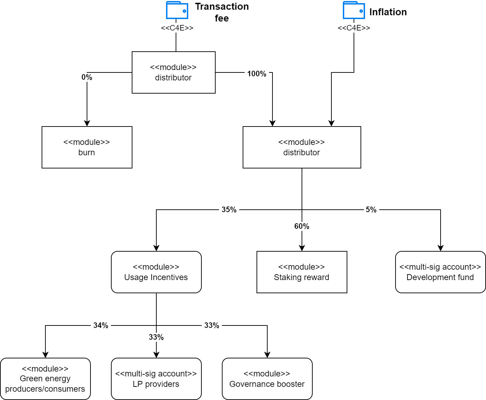

<!--
    order: 4
-->

# C4E Token

The Chain4Energy ecosystem uses the blockchain technology to tokenize transfers and relations. The C4E token is a basic element of the whole ecosystem and is used to settle payments, commissions and bonuses for generating green energy.

The C4E token is the fuel necessary for the Chain4Energy ecosystem to function, helping to coordinate and align the incentives of all parties involved. The tokenomy summarized here defines how C4E will be used in our blockchain as well as how it will be distributed.

Following utility is designed within our token:

* Native token of Chain4Energy.
* Transaction fee - C4E token is required to perform transactions in our blockchain.
* Staking - provides security of the Chain4Energy network
* LP Farming - incentive for liquidity provided at selected DEXes.
* Reward - for production, storage and usage of renewable energy. The reward mechanism will depend on the stage of the project. At the initial stage where the main goal is expansion we will be encouraged to invite new users/members.
* **Access to services **- giving access to services** **that would not be available to entities without a token, offered by chain4energy labs and other partners launching their solutions on the Chain4Energy platform

Transaction fees

All transaction fees are paid in C4E tokens. So far, as the other Cosmos SDK based chains we are using gas mechanizm to calculate transaction fee.

In the future we will switch over to the mechanism which is tailored to the business as usual approach, where the transaction fee is predictable and not dependent on the price of the underlying token.

Fee distribution mechanism

The fee is divided into following parts:

* 100-90% - Distributed via the same module as new blocks (inflation)
* 0%-10% - Burn mechanism module to make the token deflationary.

Above share is the initial proposal before TGE. It is subject to adjustment by the DAO governance. The burn share is set to 0% to concentrate on the growth of the network.

## Next {hide}

Get an high-level [overview](README.md) of Ethermint {hide}
