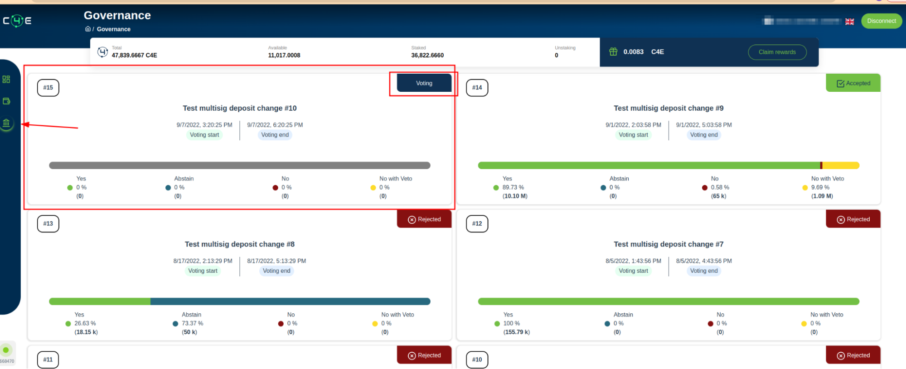
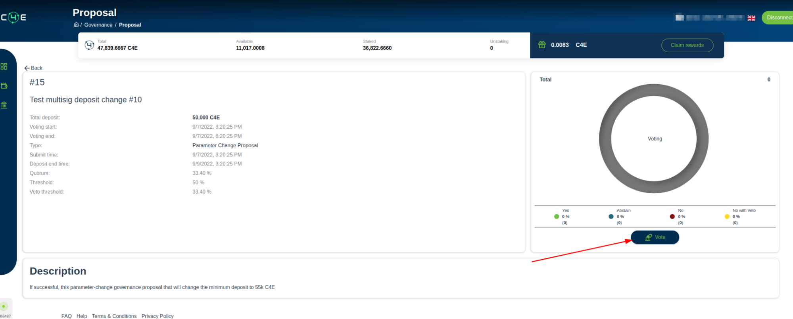
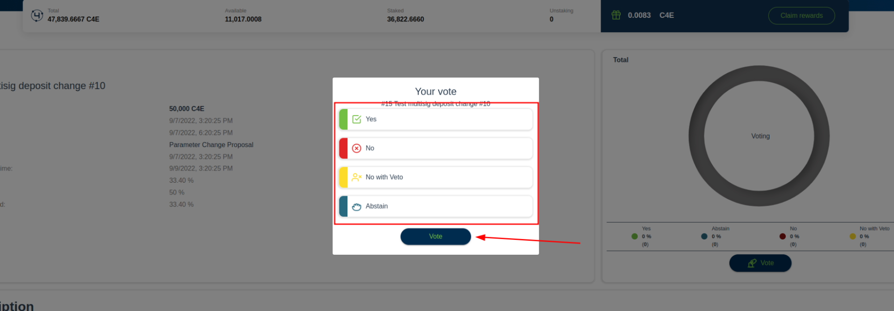
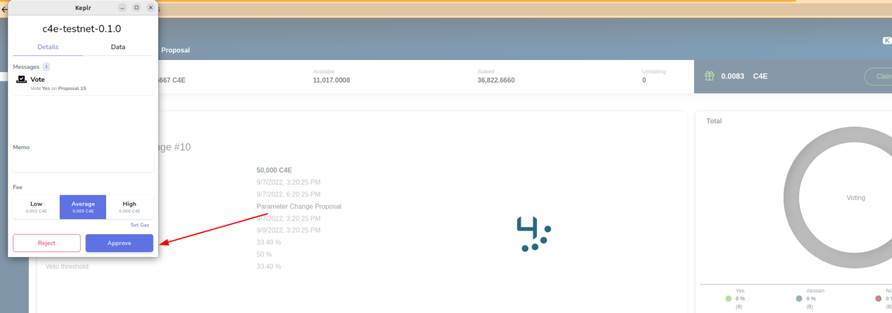
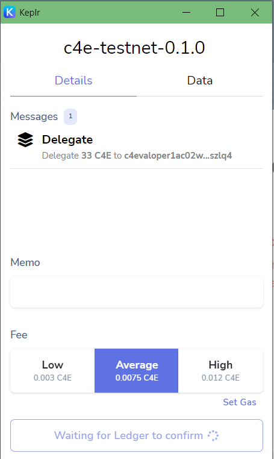

# Διακυβέρνηση

Στη διακυβέρνηση οι χρήστες μπορούν να δουν διαφορετικές προτάσεις και να ψηφίσουν γι' αυτές. Οι επιλογές ψηφοφορίας είναι διαθέσιμες στους χρήστες που έχουν στοιχηματίσει tokens. Τα στοιχηματισμένα tokens είναι το μέτρο της δύναμης ψηφοφορίας.

**!Να θυμάστε ότι μόνο τα tokens που είναι στοιχηματισμένα σε επικυρωτές στο τέλος της περιόδου ψηφοφορίας θα υπολογίζονται στην τελική απόφαση ψηφοφορίας.**

Για να ψηφίσετε πρέπει να είστε συνδεδεμένοι και να έχετε κάποια tokens στοιχηματισμένα στους επικυρωτές.

Για να ψηφίσετε ακολουθήστε τα επόμενα βήματα:

1. Μεταβείτε στη σελίδα "[διακυβέρνηση](https://wallet.c4e.io/governance)" στην εφαρμογή πορτοφολιού;
2. Βρείτε την πρόταση που θέλετε να ψηφίσετε;

3. Βεβαιωθείτε ότι η πρόταση δεν έχει λήξει;
4. Κάντε κλικ στην πρόταση για να μεταβείτε στις λεπτομέρειες της πρότασης;
5. Στη σελίδα λεπτομερειών της πρότασης κάντε κλικ στο “Ψηφίστε”

6. Επιλέξτε την επιλογή ψηφοφορίας σας;

7. Στο παράθυρο του Keplr κάντε κλικ στο Έγκριση;

    !Σημείωση αν χρησιμοποιείτε τον τρόπο σύνδεσης μέσω Ledger πρέπει να εγκρίνετε τη δράση μέσω Ledger

8. Η ψηφοφορία ολοκληρώθηκε
