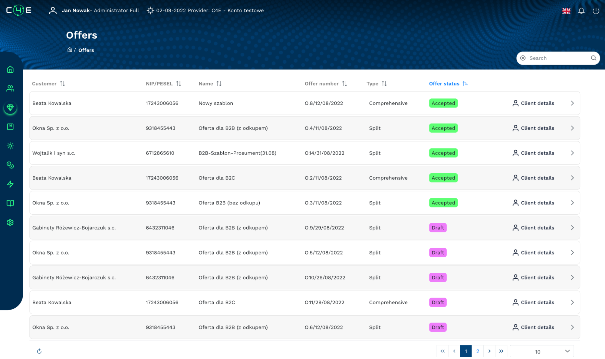

<!--
  order: 4
-->
# ΕΠΙΠΕΔΟ 2 - Απόκτηση Ενέργειας & Αυτοματοποίηση Τιμολόγησης

Για να διασφαλιστεί η διαχείριση των παραπάνω περιπτώσεων χρήσης, είναι απαραίτητο να διαχειρίζεστε σωστά όλους τους τύπους συμμετεχόντων στην πράσινη αγορά, την απόκτησή τους, τη διακανονισμό και την συνεχιζόμενη υποστήριξη για την παραγόμενη και καταναλωμένη ενέργεια. Έχουμε δημιουργήσει μια ολοκληρωμένη και τεχνολογικά μοναδική λύση που περιέχει τους μηχανισμούς ευέλικτου CRM, αυτοματοποίησης τιμολόγησης με τιμολόγηση που σχετίζεται με αυτοματοποίηση και ανάλυση δεδομένων, ενσωματωμένη με παγκόσμιες ενεργειακές ανταλλαγές, αυτόματη συλλογή δεδομένων από διανομείς ενέργειας και έξυπνους μετρητές.

Χάρη στην "απόκτηση ενέργειας & αυτοματοποίηση τιμολόγησης", οι εταιρείες εμπορίας ενέργειας μπορούν να δημιουργούν leads, να προσελκύουν και να παρέχουν ολοκληρωμένες υπηρεσίες σε πελάτες όσον αφορά την πώληση και αγορά ενέργειας, αποκτώντας έτσι ενέργεια για περαιτέρω εμπορία. Μια ειδικά σχεδιασμένη διαδικτυακή και κινητή εφαρμογή τόσο για την εταιρεία όσο και για τον χρήστη με πρόσβαση 24/7 θα εξασφαλίσει μέγιστη διαχείριση πελατών & ενέργειας.

Κύρια χαρακτηριστικά που υποστηρίζονται από την εφαρμογή:

* Διαδικτυακή και κινητή εφαρμογή με προσωπικό πορτοφόλι C4E για διαχείριση ενεργειακών tokens.
* Διαδικασίες δημιουργίας leads και απόκτησης ενέργειας επίσης με ψηφιακές συμφωνίες (eIDAS) και υποστήριξη για τις διαδικασίες (TPA) αλλαγής προμηθευτή ενέργειας. Πλήρης υποστήριξη για πελάτες (λιανικής & B2B).
* Παρακολούθηση σε πραγματικό χρόνο της παραγωγής και κατανάλωσης ενέργειας.
* Ένας εκτενής και ευέλικτος κατάλογος προϊόντων πλήρως διαχειριζόμενος από τις εταιρείες εμπορίας ενέργειας.
* Διακανονισμός αγοράς και πώλησης ενέργειας με πλήρη αυτοματοποίηση των διαδικασιών τιμολόγησης, συλλογή δεδομένων από έξυπνους μετρητές και δεδομένα από τοπικούς διανομείς ενέργειας.
* Πλήρης σειρά αναλυτικών, προγνωστικών και αναφορικών δυνατοτήτων.

Αυτό το μοντέλο είναι επίσης υπεύθυνο για την επιβράβευση ενεργών συμμετεχόντων στην πράσινη αγορά ενέργειας. Με βάση την ποσότητα παραγόμενης ενέργειας, ο παραγωγός λαμβάνει ένα Token C4E ως επιβράβευση καθώς και αφιερωμένα οφέλη από τους προμηθευτές εμπορίας (π.χ. έκπτωση στην αγορά φωτοβολταϊκών πάνελ).

Το μοντέλο απόκτησης πελατών & ενέργειας, ως η καρδιά της λύσης όπου λαμβάνουν χώρα όλες οι αυτόματες λειτουργίες και διαδικασίες, παρέχει τα απαραίτητα δεδομένα πελατών και ενέργειας στα επόμενα έξυπνα στοιχεία του δικτύου.
